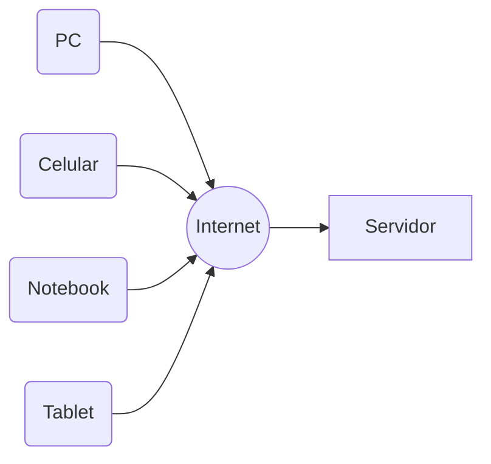
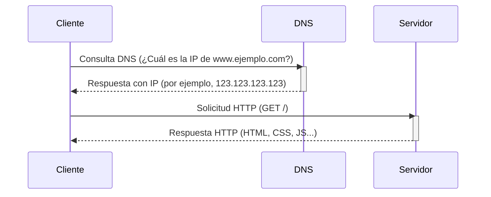

# Introducción a la web

<a href="diapositivas/1a-intro-web.html">ver diapositivas</a>

## ¿Qué es la World Wide Web?

### Diagrama simplificado



## ¿Cómo funciona la web?

1. Se ingresa una dirección (URL) en la barra de direcciones del navegador
2. La computadora (cliente) realiza una búsqueda de DNS
   - Cada sitio web tiene un código único, llamada dirección IP <!-- .element: class="fragment" -->
   - Los DNS (Servidores de Nombres de Dominio) son como agendas de teléfono <!-- .element: class="fragment" -->
   - Los DNS devolverán la dirección IP del sitio web al que se quiere ingresar<!-- .element: class="fragment" -->
3. La computadora usa esa dirección IP para conectarse al servidor y solicitarle una página
4. El servidor procesa la solicitud y puede responder:
   - Que el documento solicitado no esta disponible <!-- .element: class="fragment" -->
   - Redirigiendo al cliente a otro sitio <!-- .element: class="fragment" -->
   - Con el contenido de un archivo <!-- .element: class="fragment" -->
   - Ejecutando un programa que decide qué contenido responder <!-- .element: class="fragment" -->
   - Típicamente la respuesta incluye algún HTML y CSS con algo de JavaScript y potencialmente algún archivo multimedia <!-- .element: class="fragment" -->
5. El navegador muestra la página interpretando el código de respuesta y ensamblando los diferentes archivos. Cada navegador puede hacerlo de forma ligeramente distinta.

### Proceso simplificado



## Lado del cliente

- Cosas que suceden en la computadora independientemente del servidor <!-- .element: class="fragment" -->
- Navegador, HTML, CSS, etc <!-- .element: class="fragment" -->
- También llamado front-end <!-- .element: class="fragment" -->

## Lado del servidor

- Solicitudes siendo atendidas por un servidor <!-- .element: class="fragment" -->
- DNS, API, base de datos, etc <!-- .element: class="fragment" -->
- También llamado back-end <!-- .element: class="fragment" -->

## Tecnologías del lado del cliente

### Navegadores

- Chrome 
- Edge 
- Firefox 
- Brave 
- Safari 
- Opera 

### HTML

HTML, acrónimo de HyperText Markup Language ('lenguaje de marcado
de hipertexto'), hace referencia al lenguaje de marcado utilizado en la
creación de páginas web. Define una estructura básica y un código (denominado
código HTML) para la presentación de contenido de una página web, que incluye
texto, imágenes, videos, juegos, entre otros **elementos**.

HTML 5, es la última versión de HTML.

#### Ejemplo de HTML

```html
<!DOCTYPE html>
<html>
  <head>
    <title>Título de la página</title>
  </head>
  <body>
    El contenido de la página va aquí
  </body>
</html>
```

### CSS

CSS (Cascading Style Sheets; en español: 'hojas de estilo en cascada') es un
lenguaje informático especializado en definir y cohesionar la presentación de
un documento escrito en un lenguaje de marcado como HTML.

CSS está diseñado principalmente para marcar la separación del contenido del
documento y la forma de presentación de este, características tales como las
capas o layouts, los colores y las fuentes.

CSS 3, es la última versión de CSS.

#### Ejemplo de CSS

```css
body {
  background-color: #f0f0f0;
  font-family: Arial, sans-serif;
}

h1 {
  color: #0066cc;
  text-align: center;
}

p {
  color: #333;
  font-size: 18px;
  text-align: center;
}
```

### JavaScript

JavaScript es un lenguaje de programación interpretado, orientado a objetos,
imperativo, débilmente tipado y dinámico.

Se utiliza principalmente del lado del cliente, implementado como parte de un
navegador web permitiendo mejoras en la interfaz de usuario y páginas web
dinámicas y JavaScript del lado del servidor (Server-side JavaScript o SSJS).

#### Ejemplo de JavaScript

```js
console.log("Hola mundo");
```

## Tecnologías del lado del servidor

A ver en programación IV
