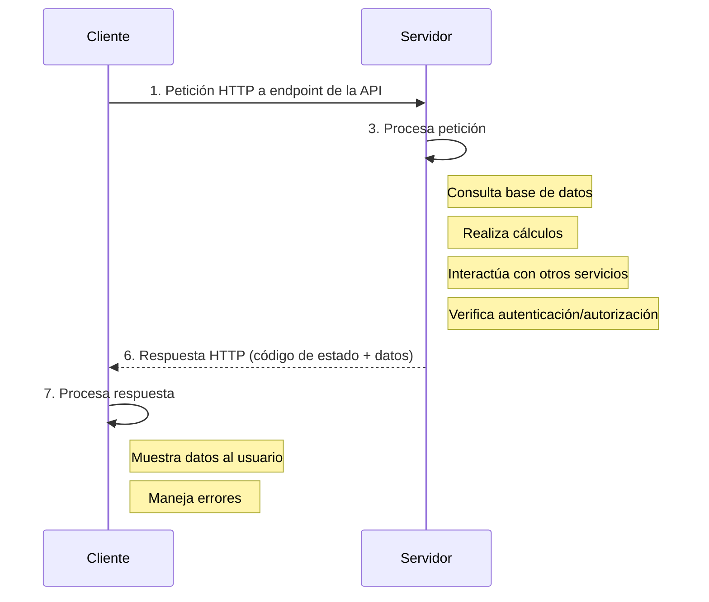

# Introducción a las APIs

## ¿Qué es una API?

Una **API (Application Programming Interface / Interfaz de Programación de Aplicaciones)** es un conjunto de reglas, definiciones, protocolos y herramientas que permiten que diferentes aplicaciones de software se comuniquen entre sí. Funciona como un contrato entre dos piezas de software, donde una ofrece información o funcionalidad (el proveedor de la API) y la otra la consume.

**Analogía:** Piensa en una API como un camarero en un restaurante. Tú (el cliente o tu aplicación) no necesitas saber cómo se cocina la comida (la lógica interna del otro software). Simplemente le das tu pedido (una petición) al camarero (la API), y él se encarga de comunicarlo a la cocina (el servidor/proveedor) y te trae la comida (la respuesta) cuando está lista. El camarero es la interfaz que te permite interactuar con la cocina sin necesidad de conocer sus detalles internos.

## ¿Para qué sirven las APIs?

- **Interoperabilidad:** Permiten que sistemas diferentes, construidos con tecnologías distintas, puedan intercambiar datos y funcionalidades.
- **Reutilización de Funcionalidad:** Evitan tener que "reinventar la rueda". Se puede usar la funcionalidad ofrecida por otra aplicación a través de su API (ej. usar la API de Google Maps para mostrar mapas en tu web).
- **Modularidad y Flexibilidad:** Permiten construir aplicaciones más modulares, donde diferentes componentes pueden ser desarrollados y actualizados de forma independiente.
- **Automatización:** Facilitan la automatización de tareas al permitir que los scripts y programas interactúen con otras aplicaciones.
- **Acceso a Datos:** Proveen una forma controlada y segura para que aplicaciones externas accedan a ciertos datos de un servicio (ej. API de Twitter para obtener tweets).

## Tipos Comunes de APIs (con foco en APIs Web)

Existen muchos tipos de APIs, pero en el desarrollo web y de aplicaciones modernas, las **APIs Web** son las más comunes:

- **APIs REST (Representational State Transfer):** Son el tipo más popular actualmente. Utilizan los métodos estándar de HTTP (GET, POST, PUT, DELETE, etc.) para realizar operaciones sobre "recursos" (datos). Suelen usar JSON como formato de intercambio de datos. Son conocidas por ser simples y escalables.
- **APIs SOAP (Simple Object Access Protocol):** Un protocolo más antiguo y más formal, que utiliza XML para los mensajes y opera sobre HTTP o SMTP. Es más estricto en cuanto a estructura y seguridad.
- **GraphQL:** Un lenguaje de consulta para APIs y un tiempo de ejecución del lado del servidor para ejecutar esas consultas. Permite a los clientes solicitar exactamente los datos que necesitan y nada más, lo que puede ser más eficiente que REST en algunos casos.
- **APIs de Navegador:** Son APIs incorporadas en los navegadores web que permiten a los desarrolladores interactuar con el navegador y el entorno del usuario. Ejemplos:
  - **DOM API:** Para manipular la estructura HTML y CSS de una página.
  - **Geolocation API:** Para obtener la ubicación del usuario.
  - **Fetch API / XMLHttpRequest:** Para realizar peticiones HTTP (¡justo lo que usaremos para consumir otras APIs web!).
  - **LocalStorage / SessionStorage API:** Para almacenar datos en el navegador.
- **APIs de Sistemas Operativos:** Permiten a las aplicaciones interactuar con el sistema operativo subyacente para acceder a archivos, hardware, etc.

## Conceptos Clave en APIs Web (especialmente REST)

- **Cliente:** La aplicación que inicia la petición a la API para obtener datos o realizar una acción. (Ej: tu aplicación JavaScript en el navegador).
- **Servidor:** El sistema que aloja la API y que responde a las peticiones del cliente.
- **Petición (Request):** Un mensaje enviado por el cliente al servidor de la API. Generalmente incluye:
  - **Endpoint (URL):** La dirección específica del recurso al que se quiere acceder. Ej: `https://api.ejemplo.com/usuarios/123`
  - **Método HTTP:** La acción que se desea realizar (GET, POST, PUT, DELETE, etc.).
    - `GET`: Solicitar datos.
    - `POST`: Enviar datos para crear un nuevo recurso.
    - `PUT`: Enviar datos para actualizar un recurso existente.
    - `DELETE`: Eliminar un recurso.
  - **Cabeceras (Headers):** Metadatos sobre la petición (ej: tipo de contenido, información de autenticación).
  - **Cuerpo (Body - opcional):** Los datos que se envían al servidor (ej: en peticiones POST o PUT, usualmente en formato JSON).
- **Respuesta (Response):** Un mensaje enviado por el servidor al cliente después de procesar la petición. Generalmente incluye:
  - **Código de Estado HTTP:** Un número que indica el resultado de la petición (ej: 200 OK, 404 Not Found, 500 Internal Server Error). [Ver códigos comunes](https://developer.mozilla.org/es/docs/Web/HTTP/Status).
  - **Cabeceras (Headers):** Metadatos sobre la respuesta.
  - **Cuerpo (Body - opcional):** Los datos solicitados o el resultado de la operación (ej: datos en formato JSON).
- **Endpoint:** Una URL específica donde la API puede ser accedida por un cliente. Cada endpoint corresponde a una función o recurso particular.
- **Formatos de Datos:**
  - **JSON (JavaScript Object Notation):** El formato más común para el intercambio de datos en APIs web debido a su simplicidad y facilidad de uso con JavaScript.
  - **XML (eXtensible Markup Language):** Otro formato, más verboso que JSON, usado especialmente en APIs SOAP.
- **Autenticación y Autorización:**
  - **Autenticación:** Proceso de verificar quién es el cliente (identidad). Métodos comunes incluyen claves de API (API Keys), tokens (ej: JWT - JSON Web Tokens), OAuth.
  - **Autorización:** Proceso de verificar qué puede hacer un cliente autenticado (permisos).

## Flujo Típico de una Petición a una API Web

1. El cliente (ej: tu app JavaScript) construye una petición HTTP a un endpoint específico de la API.
2. La petición se envía a través de internet al servidor que aloja la API.
3. El servidor de la API recibe la petición.
4. El servidor procesa la petición: puede consultar una base de datos, realizar cálculos, interactuar con otros servicios, etc. (Si es necesario, verifica la autenticación y autorización).
5. El servidor construye una respuesta HTTP (con un código de estado y, opcionalmente, datos en el cuerpo).
6. La respuesta se envía de vuelta al cliente.
7. El cliente recibe la respuesta y la procesa (ej: muestra los datos al usuario, maneja errores).

## Consumiendo APIs con JavaScript

En JavaScript moderno, la forma más común de interactuar con APIs web es usando la **Fetch API**, que es una interfaz nativa del navegador para realizar peticiones HTTP. También existe el objeto `XMLHttpRequest` más antiguo, pero `fetch` es más moderno y basado en Promesas.
