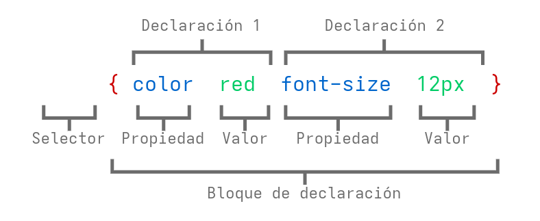

# Introducción a CSS

---

## CSS

CSS es un "lenguaje de hojas de estilo" que permite aplicar estilo a los elementos de la página.

CSS funciona en conjunto con HTML, pero no es HTML en sí.

---

## La regla CSS



---

## Conectado CSS con HTML

1. En línea
2. Integrado
3. Externa

---

### En línea

Se emplea el atributo `style`

```html
<p style="color:red">Un texto</p>
```

Se cambia el estilo de un elemento HTML a la vez.

- ¿Cómo se pueden modificar todos los elementos de un archivo HTML? <!-- .element: class="fragment" -->

---

### Integrado

Dentro del elemento `<head>`, emplear la etiqueta `<style>`.

```html
<head>
  <style type="text/css">
    p {
      color: blue;
      font-size: 12px;
    }
  </style>
</head>
```

Se puede cambiar el estilo de todos los párrafos en un archivo HTML a la vez

- ¿Cómo se pueden modificar los elementos de multiples archivos HTML? <!-- .element: class="fragment" -->

---

### Externa

Colocar las reglas CSS en un archivo separado y usar un enlace (`<link>`) a ese archivo en todos sus archivos HTML.

```html
<!DOCTYPE >
<html>
  <head>
    <link rel="stylesheet" type="text/css" href="estilo.css" />
  </head>
  <body>
    ...
  </body>
</html>
```

---

### Externa

¿Por qué se prefieren los archivos CSS externos?

- Recurso compartido para varias páginas.
- Reducción del tamaño de archivo y del ancho de banda.
- De fácil mantenimiento en proyectos grandes.

---

## Sintaxis CSS

- Selector: Elemento(s) HTML a los que desea aplicar la regla CSS.
- Declaración: Pares propiedad-valor que definen el estilo que planea usar en el elemento HTML.
  - Las declaraciones terminan en punto y coma.
  - Los bloques de declaraciones se encierran entre llaves.

---


---

## Selectores CSS

- Elementos
- Id
- Clase
- `*`
- Elemento Elemento
- Elemento, Elemento

---

### Elementos

El selector de elementos selecciona **todos** los elementos con el nombre de elemento especificado.

```css
p {
  color: yellow;
}

body {
  background-color: red;
}
```

---

### Id

El selector #id aplica estilo al elemento con el atributo id especificado.

```html
<h1 id="encabezado">Este es un encabezado</h1>
<strong id="nombre">Este en un nombre</strong>
```

```css
#encabezado {
  color: yellow;
}

#nombre {
  background-color: red;
}
```

---

### Clase

El selector .class selecciona todos los elementos con un atributo de clase específico.

```html
<h1 class="titulo">Este es un título</h1>
<p class="direccion">Esta en una dirección</p>
```

```css
.titulo {
  font-size: 36px;
}

.direccion {
  font-style: italic;
}
```

---

### Clase

También se puede especificar que una clase solo afecte a elementos HTML
específicos. Para ello, se comienza con el nombre del elemento, luego el punto
(.) y a continuación el nombre de la clase.

```html
<h1 class="titulo">Este es un título</h1>
<p class="titulo">Esta en una dirección</p>
```

```css
h1.titulo {
  font-size: 36px;
}
```

---

### `*`

El selector `*` selecciona todos los elementos.

```css
* {
  font-size: 10px;
}
```

El selector `*` también puede seleccionar todos los elementos dentro de otro elemento.

```css
p * {
  background-color: green;
}
```

---

### Elemento Elemento

El selector elemento elemento es empleado para seleccionar elementos dentro de elementos.

```html
<p>Esta es una <strong>dirección</strong> en un fondo verde</p>
```

```css
p strong {
  background-color: green;
}
```

---

### Elemento,Elemento

Para aplicar el mismo estilo a varios elementos, separar el nombre de cada elemento con una coma.

```html
<p>Esta en un párrafo</p>
<h1>Este es un título</h1>
```

```css
p,
h1 {
  background-color: green;
}

p {
  font-size: 10px;
}
```

---

## En cascada

Los estilos se despliegan "en cascada" hasta que se modifican.

```css
p {
  color: blue;
  font-family: Helvetica;
}

.red {
  color: red;
}

#especial {
  font-family: Arial;
}
```

```html
<p>Párrafo</p>
<p class="red">Párrafo</p>
<p class="red" id="especial">Párrafo</p>
```

---

## Prioridad

El navegador asigna diferentes prioridades a las reglas CSS según el tipo de selector.

1. CSS en línea
2. ID
3. Clase
4. Elemento

---

## Prioridad por especificidad

El navegador también asigna prioridad según la especificidad de la selección. Los selectores más específicos tienen mayor prioridad.

```css
.main .sale .clearence p { // Más específico
  color: red;
}

.header .title p {
  color: green;
}

.footer p { // Menos específico
  color: blue;
}
```

---

## Prioridad por posición

El factor decisivo es la posición. Las reglas que se encuentran más abajo en el archivo sobrescriben las reglas que se encuentran más arriba.

```css
a {
  background-color: red;
}

a {
  background-color: yellow;
}

a {
  background-color: black;
}
```

---

## Valores CSS

- Color
- Longitudes y porcentajes

---

### Colores

El navegador puede aceptar colores de muchas maneras diferentes:

- Nombre del color (ej. `red`)
- Valor hexadecimal (ej. `#FF0000`)
- Valor RGB (ej. `rgb(255, 0, 0)`)
- Valor HSL (ej. `hsl(0, 100%, 100%)`)

Los 17 colores estándar con nombre son: aqua, black, blue, fucsia, gray, grey, green, lime, maroon, navy, olive, purple, red, silver, teal, white y yellow.

Con la posible excepción del blanco y el negro, los nombres de colores tienen un uso limitado en sitios web modernos y bien diseñados debido a su especificidad y limitaciones.

---

### Longitudes y porcentajes

Existen muchas unidades específicas de cada propiedad para los valores que se
usan en CSS, pero existen algunas unidades generales que se utilizan en
diversas propiedades.

---

- px (como `font-size: 12px`) es la unidad para píxeles.
- em (como `font-size: 2em`) es la unidad para el tamaño calculado de una fuente. Por ejemplo, "2em" es el doble del tamaño de fuente actual.
- pt (como `font-size: 12pt`) es la unidad para puntos, para medidas típicas en medios impresos.
- % (como `width: 80%`) es la unidad para porcentajes.
- Otras unidades incluyen pc (picas), cm (centímetros), mm (milímetros) e in (pulgadas).
- Cuando un valor es cero, no es necesario indicar la unidad. Por ejemplo, si no quisiera especificar ningún borde, sería `border: 0`.

---

## Propiedades CSS

- Color
- Texto
- Espaciado de texto

---

### Propiedades CSS: Color

Para definir el color del texto, utilizamos la propiedad `color`:

```css
p {
  color: yellow;
}
```

Para definir el color de fondo, utilizamos la propiedad `background-color`:

```css
body {
  background-color: red;
}
```

---

### Propiedades CSS: Texto

Se puede modificar el tamaño y la forma del texto de una página web con diversas propiedades.

`font-family`: Esta es la fuente en sí, como Times New Roman, Arial o Verdana.

El navegador debe poder encontrar la fuente que se especifica, lo que, en la mayoría de los casos, significa que debe estar en el ordenador, por lo que no tiene mucho sentido usar fuentes poco conocidas que solo están en el ordenador.

Existen algunas fuentes "seguras" (las más utilizadas son Arial, Verdana y Times New Roman), pero se puede especificar más de una, separadas por comas.

El objetivo es que, si el usuario no tiene la primera fuente que se especifica, el navegador recorra la lista hasta encontrar una que sí tenga.

---

### Propiedades CSS: Texto

```css
p {
  font-family: Arial, Helvetica, Serif;
}
```

Primero se buscará la fuente Arial y, si el navegador no la encuentra, buscará Helvetica y luego una fuente serif.

Si el nombre de una fuente tiene más de una palabra, debe escribirse entre comillas.

```css
p {
  font-family: "Times New Roman";
}
```

---

- `font-size`: establece el tamaño de la fuente (unidades como px, em, pt).
- `font-weight`: indica si el texto está en negrita (bold, light, normal, etc.).
- `font-style`: indica si el texto está en cursiva (italic, normal).
- `text-decoration`: indica si el texto tiene una línea debajo, encima o a través de él (underline, overline, line-through, none).
- `text-transform`: cambia el formato del texto (capitalize, uppercase, lowercase, none).

---

### Propiedades CSS: Espaciado de texto

- `letter-spacing`: establece el espaciado entre letras. El valor puede ser una longitud o normal.
- `word-spacing`: establece el espaciado entre palabras. El valor puede ser una longitud o normal.
- `line-height`: establece la altura de las líneas en un elemento, como un párrafo, sin ajustar el tamaño de la fuente. Puede ser un número (que especifica un múltiplo del tamaño de la fuente; por ejemplo, "2" será el doble del tamaño de la fuente), una longitud, un porcentaje o normal.
- `text-indent`: sangra la primera línea de un párrafo con una longitud o porcentaje determinado.
- `text-align`: alinea el texto dentro de un elemento a la izquierda, derecha, centrado o justificado (left, right, center, justify).
